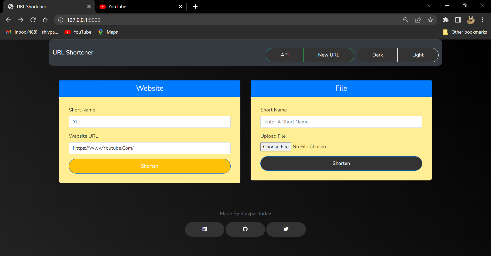
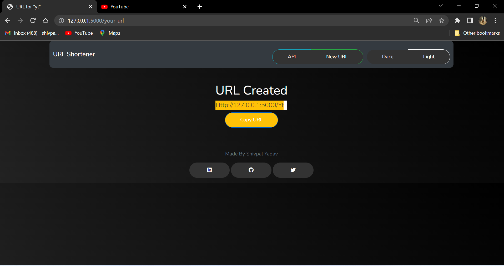
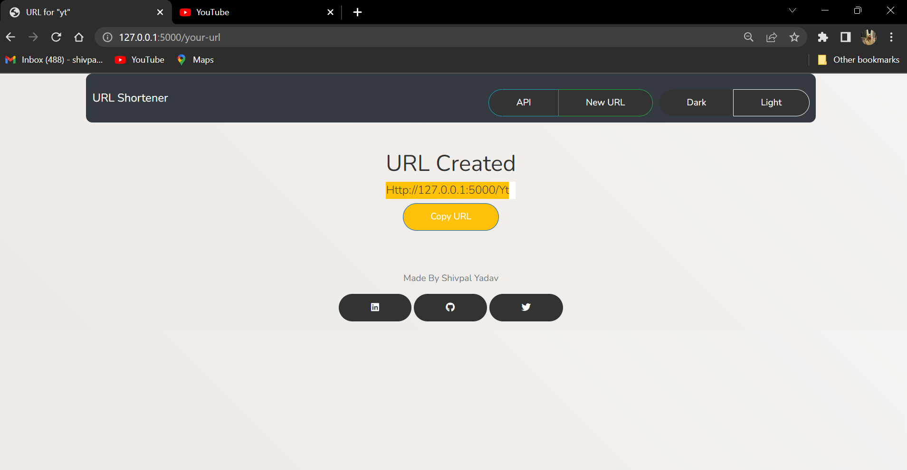
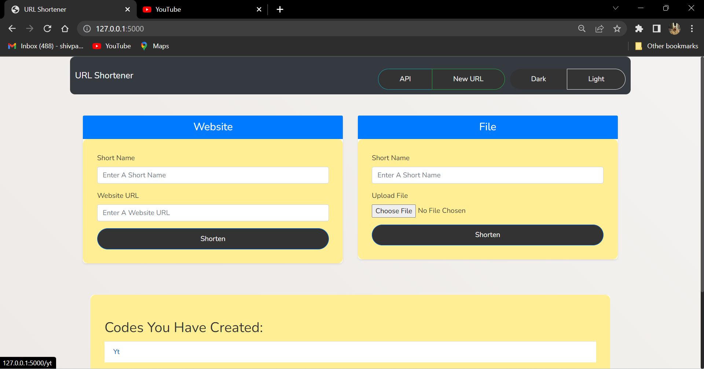

---
# URL Shortener

URL Shortener is a simple web application built with Flask that allows users to shorten URLs and manage their shortened links. It provides a user-friendly interface for creating short URLs for websites or uploading files. Additionally, it offers an API for programmatically interacting with the URL shortening functionality.

<div align="center">
  
  
  
  
</div>

## Installation

To run the app flawlessly, make sure to satisfy the following requirements:

1. Clone the repository:

   ```bash
   git clone https://github.com/your-username/URL-Shortener.git
   ```

2. Navigate to the project directory:

   ```bash
   cd URL-Shortener
   ```

3. Install the required dependencies:

   ```bash
   pip install -r requirements.txt
   ```

4. Set the required environment variables:

   ```bash
   export FLASK_APP=app.py
   export FLASK_ENV=development
   ```

5. Start the server:

   ```bash
   flask run
   ```

   Alternatively, you can run the following command:

   ```bash
   python -m flask run
   ```

6. Open your web browser and access the application at `http://localhost:5000`.

## Project Structure

### Codes and Functions

#### `__init__.py`

- `create_app(test_config=None)`: This function initializes and configures the Flask application. It registers the `urlshort` blueprint and sets the secret key for the app.

- `app`: The Flask application instance.

#### `urlshort.py`

- `bp`: The blueprint for the URL Shortener.

- `home()`: Renders the home page, displaying the list of created codes.

- `your_url()`: Handles the form submission for creating a shortened URL. It validates the form inputs and saves the URL or file information to the `urls.json` file.

- `redirect_to_url(code)`: Redirects the user to the original URL or the uploaded file corresponding to the given `code`.

- `page_not_found(error)`: Renders the "Page Not Found" page when a requested URL is not found.

- `session_api()`: Returns a JSON response containing the list of active session keys.

#### `templates` folder

- `base.html`: The base HTML template that defines the common structure and styling for all other templates.

- `home.html`: The template for the home page, where users can enter URLs or upload files to be shortened.

- `your_url.html`: The template for displaying the shortened URL after it is created.

- `page_not_found.html`: The template for the "Page Not Found" error page.


## Usage

1. **Home Page:** The home page (`http://localhost:5000`) allows you to shorten a website URL or upload a file. Enter a short name and a URL or choose a file to upload, then click the "Shorten" button.
2. **Shortened URL:** After shortening a URL, you will be redirected to a page displaying the shortened URL. You can copy and share this URL.
3. **Existing Codes**: If you have previously created any shortened URLs, they will be listed on the home page under "Codes you have created."

## API

The URL shortener project also provides an API endpoint to retrieve the list of session keys (shortened URLs). You can access the API at `http://localhost:5000/api`.

## Themes

The URL shortener supports both light and dark themes. You can switch between themes using the buttons in the navigation bar.

## API Functions

The URL Shortener application also provides the following API functions:


#### `1. Shorten a URL`

- **Endpoint:** `/api/shorten`
- **Method:** POST
- **Request Body:**
  - `url` (string): The URL to be shortened.
- **Response:**
  - `short_url` (string): The generated short URL.
- **Example:**

  ```bash
  curl -X POST -H "Content-Type: application/json" -d '{"url": "https://example.com"}' http://localhost:5000/api/shorten
  ```

  **Response:**

  ```json
  {"short_url": "http://localhost:5000/abc123"}
  ```

#### ` 2. Retrieve the original URL`

- **Endpoint:** `/api/url/<short_name>`
- **Method:** GET
- **Response:**
  - `url` (string): The original URL associated with the given `short_name`.
- **Example:**

  ```bash
  curl -X GET http://localhost:5000/api/url/abc123
  ```

  **Response:**

  ```json
  {"url": "https://example.com"}
  ```

#### ` 3. Retrieve all shortened URLs`
- **Endpoint:** `/api/urls`
- **Method:** GET
- **Response:**
  - `urls` (list): A list of shortened URLs and their associated original URLs.
- **Example:**

  ```bash
  curl -X GET http://localhost:5000/api/urls
  ```

  **Response:**

  ```json
  {"urls": [{"short_name": "abc123", "original_url": "https://example.com"}, {"short_name": "def456", "original_url": "https://example.org"}]}
  ```


## Author

This URL shortener project was created by Shivpal Yadav.

- LinkedIn: [https://www.linkedin.com/in/yshivv/](https://www.linkedin.com/in/yshivv/)
- GitHub: [https://github.com/yshivv](https://github.com/yshivv)
- Twitter: [https://twitter.com/shhiwy](https://twitter.com/shhiwy)

Feel free to reach out if you have any questions or suggestions!


---
